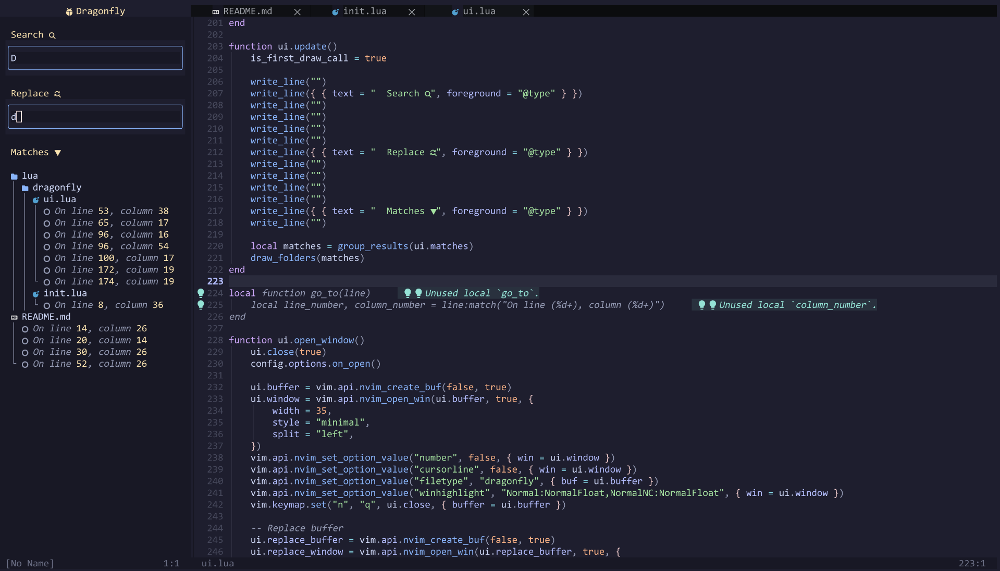
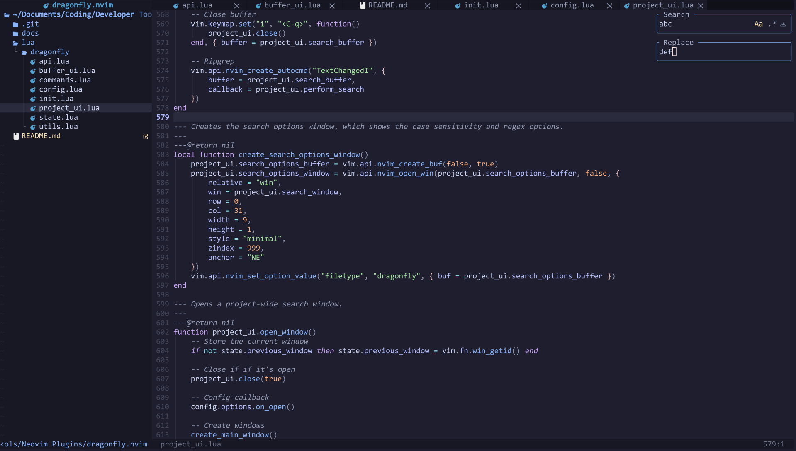

# 🪰 `dragonfly.nvim`

⚠️ **Warning: Dragonfly is in beta. Expect some bugs.**

A pretty search & replace plugin for Neovim.

<details>
	<summary><strong>Screenshots</strong></summary>
	<p>Project-Wide Search & Replace:</p>
    
	<p>Single Buffer Search & Replace:</p>
    
</details>

## ✨ Features

`dragonfly.nvim` comes with the following features:

-   🔍 (Prettier) single file search and replace
-   📁 Project-wide search and replace
-   ✅ Toggles for case sensitivity, regular expression searching, and whole-word-only matching
-   🚫 Optional ignoring for gitignored files, dotfiles, etc.
-   ⚡ Rapid performance with [ripgrep](https://github.com/BurntSushi/ripgrep)

## 📦 Installation & Configuration

It's required to [install ripgrep](https://github.com/BurntSushi/ripgrep?tab=readme-ov-file#installation) before using `dragonfly.nvim`.

Basic installation expample (with `lazy.nvim`):

```lua
{
    "vi013t/dragonfly.nvim",
    dependencies = { "nvim-tree/nvim-web-devicons" },
    opts = {},
    keys = {
        { "/", "<cmd>DragonflyBuffer<cr>" },
        { "?", "<cmd>DragonflyBufferReplace<cr>" },
        { "<C-/>", "<cmd>DragonflyProject<cr>" },
        { "<C-?>", "<cmd>DragonflyProjectReplace<cr>" },
    }
}
```

<details>
    <summary>Default Configuration</summary>

```lua
{
    "vi013t/dragonfly.nvim",
    opts = {
        on_open = function() end,
        on_close = function() end,
        default_search_options = {
            case_sensitive = true,
            regex = false,
            whole_word = false,
        },
        ignore = {
            "gitignored",
            "dotfiles",
        }
    },
    keys = {
        { "/", "<cmd>DragonflyBuffer<cr>" },
        { "?", "<cmd>DragonflyBufferReplace<cr>" },
        { "<C-/>", "<cmd>DragonflyProject<cr>" },
        { "<C-?>", "<cmd>DragonflyProjectReplace<cr>" },
    }
}
```

</details>

<details>
    <summary>Example for replacing Neo-Tree</summary>

    Here's an example of setting up `dragonfly.nvim` such that it closes and replaces Neotree when it opens, and reopens Neotree when it closes.

```lua
{
    "vi013t/dragonfly.nvim",
    dependencies = { "nvim-tree/nvim-web-devicons" },
    opts = {

        -- Called when dragonfly is opened
        on_open = function()
            if vim.fn.exists(":NeoTreeClose") then vim.cmd("NeoTreeClose") end
        end,

        -- Called when dragonfly is closed
        on_close = function()
            local has_neotree = pcall(function() require("neo-tree") end)
            if has_neotree then vim.cmd("Neotree") end
        end,

    },
    keys = {
        { "/", "<cmd>DragonflyBuffer<cr>" },
        { "?", "<cmd>DragonflyBufferReplace<cr>" },
        { "<C-/>", "<cmd>DragonflyProject<cr>" },
        { "<C-?>", "<cmd>DragonflyProjectReplace<cr>" },
    }
},

```

</details>

<details>
    <summary>Example config for `bufferline.nvim` title (like in demo)</summary>

```lua
{
    "akinsho/bufferline.nvim",
    config = function()

        -- Create highlight group
        local bg = vim.fn.synIDattr(vim.fn.synIDtrans(vim.fn.hlID("NormalFloat")), "bg#")
        local fg = vim.fn.synIDattr(vim.fn.synIDtrans(vim.fn.hlID("@type")), "fg#")
        vim.api.nvim_set_hl(0, "BufferlineDragonflyOffset", { bg = bg, fg = fg })

        -- Set up bufferline
        bufferline.setup({
            options = {
                offsets = {
                    {
                        filetype = "dragonfly",
                        text = "󰠭 Dragonfly",
                        highlight = "BufferlineDragonflyOffset"
                    }
                }
            },
        })
    end
}
```

</details>

## 🔌 Usage

### 🔍 Single-Buffer Search

`dragonfly.nvim` provides a prettier single-buffer search and replace. `:DragonflyBuffer` will open a single-buffer search, and `:DragonflyBufferReplace` will open a single-buffer search and replace.

In a search or search-and-replace, pressing `escape` will close and cancel the search/replace. Pressing enter will perform the search/replace.

Use `tab` and `shift + tab` to navigate to the next and previous input boxes, respectively.

Search matches are automatically highlighted, but switching into insert or command mode will unhighlight them all.

### 📁 Project Search

`dragonfly.nvim` provides a pretty project-wide search and replace. `:DragonflyProject` will open a project-wide search, and `:DragonflyProjectReplace` will open a project-wide search and replace.

In a search or search-and-replace, pressing escape will unfocus the window and return focus to the previous window.

Use `tab` and `shift + tab` to navigate to the next and previous input boxes, respectively.

Pressing `enter` on a search match will jump you to that match.

## ❓FAQ

-   Why use `dragonfly.nvim` over built-in Vim searching?
    -   `dragonfly.nvim` features project-wide searching that can respect `.gitignore`, among other things.
-   Why use `dragonfly.nvim` over [`nvim-spectre`](https://github.com/nvim-pack/nvim-spectre) / [`fzf-lua`](https://github.com/ibhagwan/fzf-lua) / etc.?
    -   Up to you. This plugin was designed to be tightly focused with a simple and intuitive UI.
-   Why is it called `dragonfly.nvim`?
    -   Dragonflies are the best hunters of any creatures. This plugin helps you hunt down strings rapidly.
