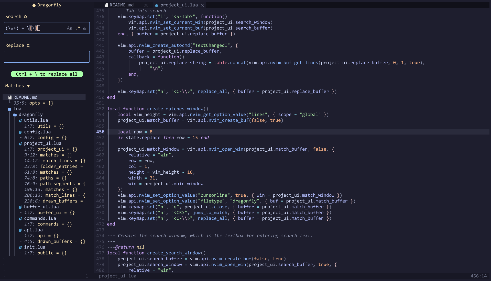

# `dragonfly.nvim`

A pretty search & replace plugin for Neovim, supporting both single file replacement and project-wide, as well as optionally respecting `.gitignore`.



### Installation & Configuration

Basic installation expample (with `lazy.nvim`):

```lua
{
    "vi013t/dragonfly.nvim",
    opts = {},
    keys = {
        { "<C-/>", "<cmd>Dragonfly<cr>" }
    }
}
```

<details>
    <summary>Default Configuration</summary>

```lua
{
    "vi013t/dragonfly.nvim",
    opts = {
        on_open = function() end,
        on_close = function() end,
    },
    keys = {
        { "<C-/>", "<cmd>Dragonfly<cr>" }
    }
}
```
</details>

<details>
    <summary>Example for replacing Neo-Tree (like in demo above)</summary>

```lua
{
    "vi013t/dragonfly.nvim",
    opts = {
        on_open = function()
            if vim.fn.exists(":NeoTreeClose") then vim.cmd("NeoTreeClose") end
        end,
        on_close = function()
            require("neo-tree") -- Load neo-tree in case it isn't yet
            vim.cmd("Neotree")
        end,
    },
    keys = {
        { "<C-/>", "<cmd>Dragonfly<cr>" }
    }
},

```
</details>

